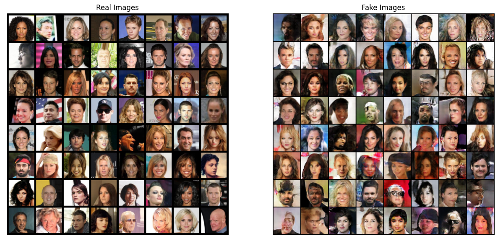

# Unsupervised Representation Learning With Deep Convolutional Generative Adversarial Networks (DCGANs)

This Jupyter notebook provides an example of DCGANs. It trains a generative adversarial network (GAN) to generate new celebrities after showing it pictures of many real celebrities. This document will give a thorough explanation of the implementation and shed light on how and why this model works.

Note that, it might help to have a GPU for running the network much faster. 

